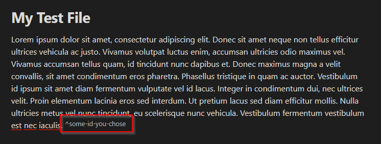
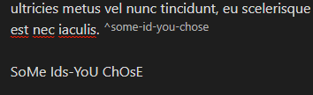
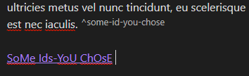
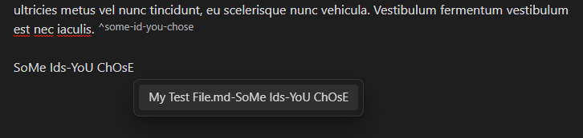

# Auto Definition Link

This is a plugin for Obsidian to automatically create links to blocks in your vault

## Features

- **Suggestion Mode**: Optionally, this plugin will show suggestions for links to create. Press enter or click on a suggestion to use it. ==(DISABLED BY DEFAULT)==
- **Auto Link Mode**: Optionally, this plugin will automatically convert a block id to a link after pressing space (or another valid interrupter)

## Usage

Once the plugin is installed and enabled, you can access its features by:

1. Creating a definition by writing a block of text, then adding a block id using `^[your id here]`. (This is native block functionality)

2. For **Auto Link Mode**, write the block id, then press `SPACE` or add punctuation.

*Note that you can ignore a suggestion in **Auto Link Mode** by pressing `SHIFT+SPACE` instead of just `SPACE`*
3. For **Suggestion Mode**, write the block id, then choose a suggestion or press `ENTER`.

**==Please note==** that Capitalization, plurality, and dashes vs spaces **do not matter**. In these examples, the plurality of "id", the capitalization, and the dashes vs spaces are not uniform or matching in any way in relation to the block id. This plugin will take care of these differences.

In both modes, the text will be replaced with a link to the block **keeping your plurality, capitalization, and dashes vs spaces**.

The plugin only scans markdown files within the same folder as the current document, so you will not be able to access definitions outside the current folder.

Both modes can be enabled/disabled independently in the plugin settings.

## Contributing

Contributions are welcome! If you have any ideas, suggestions, or bug reports, please open an issue or submit a pull request on the [GitHub repository](https://github.com/nmcarp99/Obsidian-Auto-Definition-Link).

## License

This project is licensed under the [MIT License](LICENSE).
